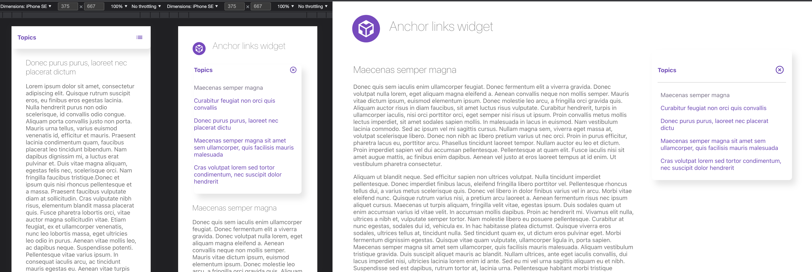

## About

A simple super-vanilla (HTML/JS/CSS) implementation of the idea for UI component.
A navigation containing anchor links (#) to scroll & position to corresponding sections of text.

Usage of [Intersection Observer API](https://developer.mozilla.org/en-US/docs/Web/API/Intersection_Observer_API) along with
code/logic for portrait viewports where as, with just a little JavaScript and CSS, this becomes separate UI widget, i.e. on phones. Usage of [zenscroll](https://github.com/zengabor/zenscroll), not mandatory and the script will fallback to window.scroll, but recommended for "smoothness", on the phone especially.

## Preview in browser

- Clone this repository
- If you do not plan tu use zenscroll, comment it out in "index.html" file, two lines by the bottom. Else: get "zenscroll-min.js" from its [repository](https://github.com/zengabor/zenscroll) and place it in "js" folder and leave "index.html" intact.

